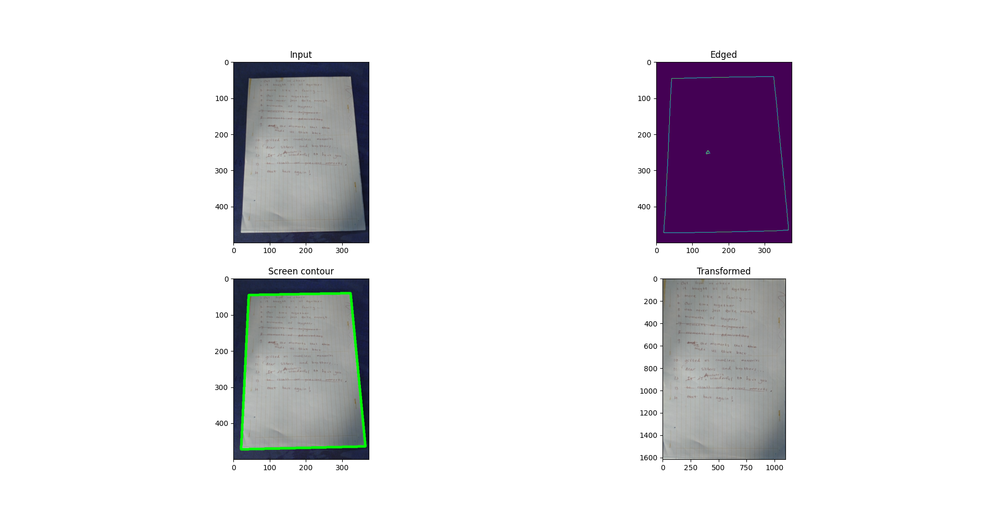
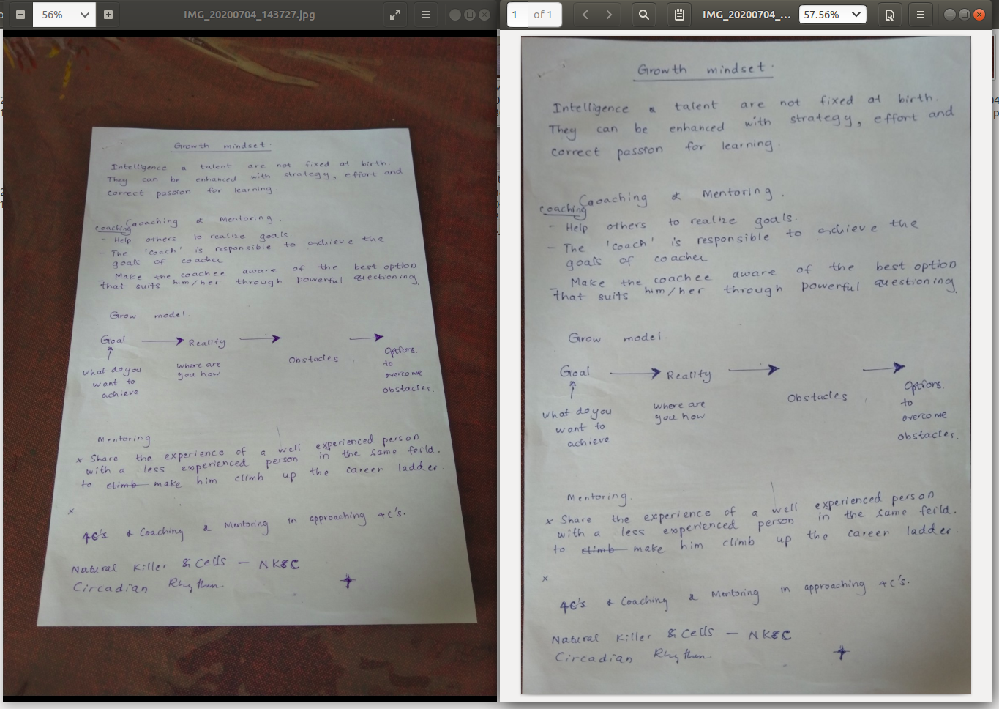

# Photo to document
Convert images to documents (PDF) including Perspective Transformation

## Installation and running
- Clone the repo and open 'photo-to-document' directory
- Create and activate the virtual environment
- run `pip install -r requirements.txt`
- _(Optional) Set env variables IMAGE_DIR, TF_IMAGE_DIR, and PDF_DIR_
- run main.py

## Results
Contour finding fail 1:

Contour finding fail 2:

Success 1:

Success 2:

Success 3:

Success 4 - PDF converted:

## Acknowledgement:
Initial version transform.py is from https://www.pyimagesearch.com/2014/08/25/4-point-opencv-getperspective-transform-example/